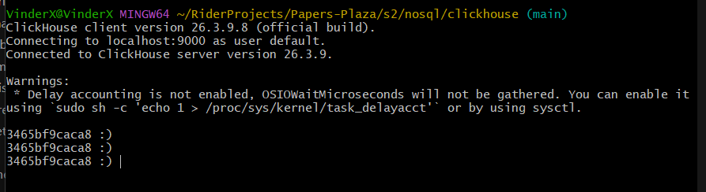
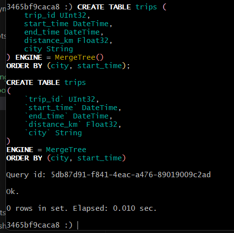
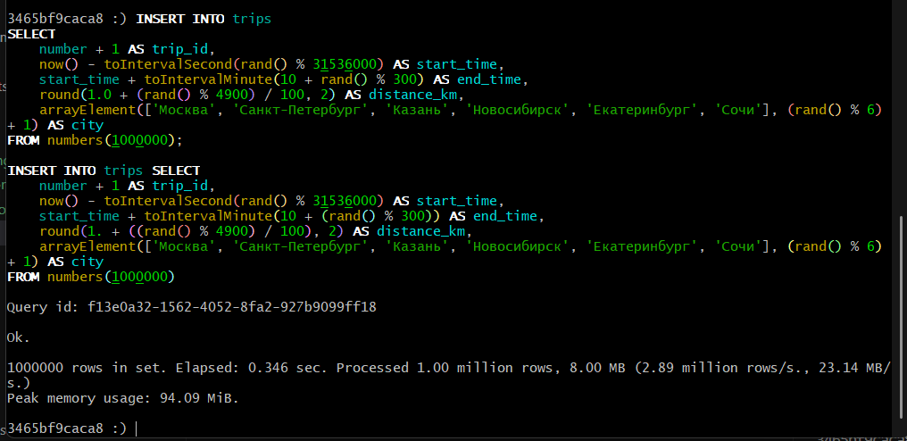
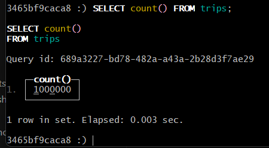
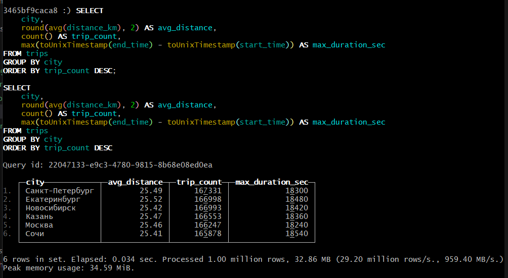

## 1. Запуск ClickHouse
Запустить ClickHouse в Docker (или в облаке).

```
docker exec -it clickhouse-hw clickhouse-client
```



Есть еще GUI через https://localhost:5086/, но он не такой визуально крутой как CLI

## 2. Создание таблицы
Создать таблицу `trips` со следующей структурой:
- `trip_id UInt32`
- `start_time DateTime`
- `end_time DateTime`
- `distance_km Float32`
- `city String`

```
CREATE TABLE trips (
    trip_id UInt32,
    start_time DateTime,
    end_time DateTime,
    distance_km Float32,
    city String
) ENGINE = MergeTree()
ORDER BY (city, start_time);
```



## 3. Наполнение данными
Сгенерировать и вставить 1 миллион строк в таблицу `trips`. Для генерации данных можно использовать любой удобный способ.

```
INSERT INTO trips
SELECT
    number + 1 AS trip_id,
    now() - toIntervalSecond(rand() % 31536000) AS start_time,
    start_time + toIntervalMinute(10 + rand() % 300) AS end_time,
    round(1.0 + (rand() % 4900) / 100, 2) AS distance_km,
    arrayElement(['Москва', 'Санкт-Петербург', 'Казань', 'Новосибирск', 'Екатеринбург', 'Сочи'], (rand() % 6) + 1) AS city
FROM numbers(1000000);
```




## 4. Написание аналитического запроса
Составить SQL-запрос, который для каждого города выводит:
- среднюю дистанцию поездки (`avg_distance`)
- общее количество поездок (`trip_count`)
- максимальную длительность поездки в секундах (`max_duration_sec`)

```
SELECT
    city,
    round(avg(distance_km), 2) AS avg_distance,
    count() AS trip_count,
    max(toUnixTimestamp(end_time) - toUnixTimestamp(start_time)) AS max_duration_sec
FROM trips
GROUP BY city
ORDER BY trip_count DESC;
```



## Ожидаемый результат
- Работающий экземпляр ClickHouse
- Заполненная таблица `trips` с 1 млн записей
- Корректно работающий агрегирующий запрос с группировкой по городам

Ну как бы да, оно в итоге и есть