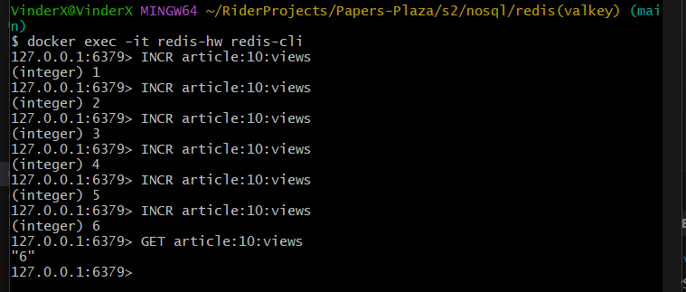
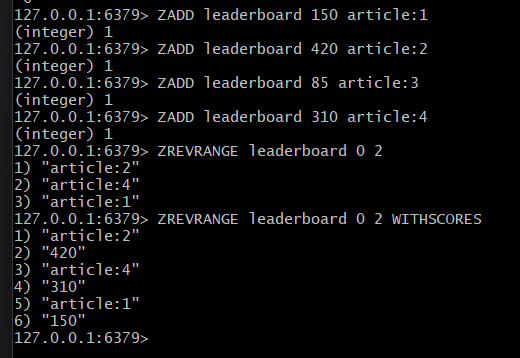
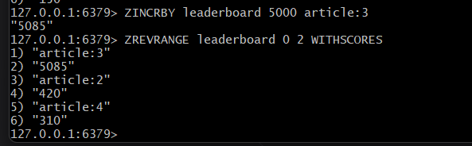
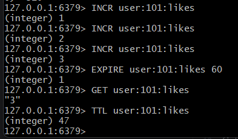

# Часть 1. Запуск Redis

1. Запустите Redis через Docker.
2. Подключитесь к Redis CLI.

```
docker exec -it redis-hw redis-cli
```

# Часть 2. Счётчик просмотров

- Представим, что у сайта есть статьи.
- Каждый просмотр должен увеличивать счётчик.
- Создайте счётчик для статьи:
- article:10:views
- Увеличьте его несколько раз.
- Затем получите текущее значение.

```
INCR article:10:views
...
INCR article:10:views

GET article:10:views
```


# Часть 3. Рейтинг статей

- Создайте leaderboard популярных статей.
- Добавьте статьи:
    - article:1
    - article:2
    - article:3
    - article:4
  с разным количеством просмотров.

- Получите топ-3 статьи без количества просмотров и с количеством просмотров.
- Добавьте к какой то статье большое количество просмотров и выведите новый топ-3


Топ-3 с кол-вом просмотров и без:


Топ-3 после изменения:


# Часть 4. Ограничение действий пользователя

- Представим, что пользователь может поставить максимум 5 лайков за минуту.
- Создайте ключ: `user:{id}:likes`
- Увеличьте его значение несколько раз.
- Задайте TTL = 60 секунд.
- Проверьте:
    - текущее значение
    - сколько времени осталось до удаления ключа

